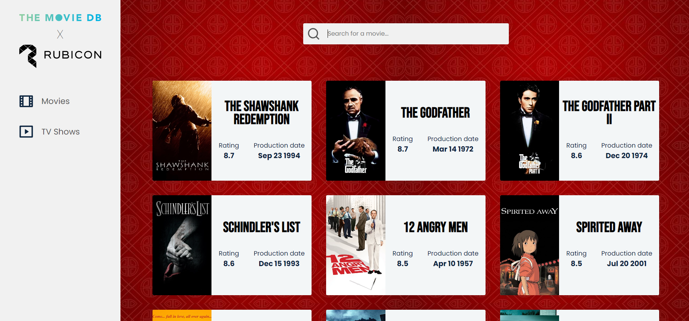
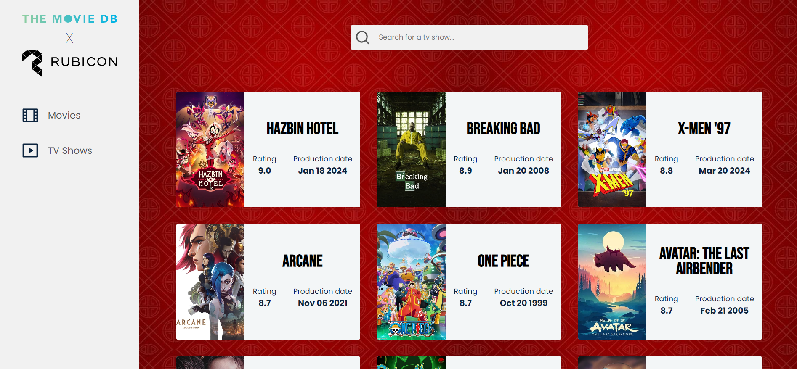
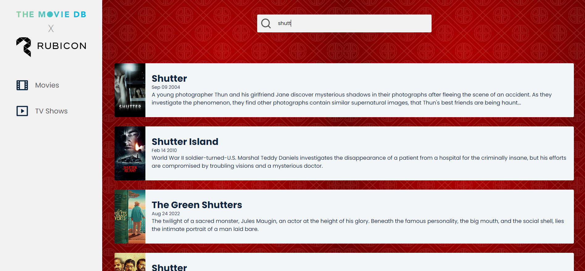
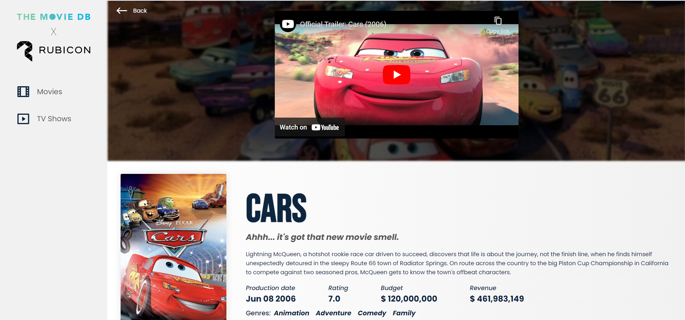

# RUBICON x The Movie Database (TMDB)

## App summary

The app has the functionalities of displaying the top 10 rated TV shows and the top 10 rated movies, a search function for both, and a detailed view for individual items. The app is fully responsive for all devices.

## Live demo: https://test-rubi-ez.netlify.app/

## How to start application

* clone this repository: `git clone https://github.com/zexach/the-movie-db`
* move to directory: `cd the-movie-db`
* install packages: `npm install`
* create `.env` file in root directory and add variable to file: `REACT_APP_API_KEY=6e45268e5987205205e3f45dabd51f36` (API_KEY is valid and was created for development purpose)
* start the application: `npm start`

* Open [http://localhost:3000](http://localhost:3000) to view it in the browser.

## Notes
Previous instructions should be enough to run the application. If you still have problems running the app, I suggest **[visiting the live demo](https://test-rubi-ez.netlify.app/)** of the application, as it's the same version of the application, just deployed using the Netlify service.

## App features

* Clicking on a page in navigation loads the top 10 MOVIES / TV SHOWS depending on the selected page.

* The search field is live and react to any change in the input field.

* The search fires a request on the search endpoint from TMDB.

* The search is performed only when there are 3 or more characters in the search bar and it is triggered only one second after the user has stopped typing.

* When there are fewer than 3 characters in the search bar, the content reverts back to the top 10 MOVIES/TV SHOWS.

* When the search is performed, results appear under the search box.

* Switching between tabs while searching triggers the search again with the same search term for the selected tab and updates the results.

* When the user clicks on a specific MOVIE/TV SHOW, he is taken to the details view.

* The Detailed View of the Movie/TV Show shows the cover image on top and in the case of Movies/TV Shows which have a trailer shows the trailer video instead of the cover image. Below the image/trailer, information regarding the selected Movie/TV Show are shown.

* The Back Button returns the user back to where he was and with the same state before clicking to see more information about a Movie/TV Show. 

# Technical information
* App is created with **React** + **Typescript**
* **React Router** is used for routing
* **axios** is used for making HTTPS requests
* **React Context** is used for global state management
* **SCSS** is utilized for styling, leveraging its features like variables, mixins, and nesting for a more maintainable and organized styling approach

## Movies page

## TV Shows page

## Search 

## Details page

